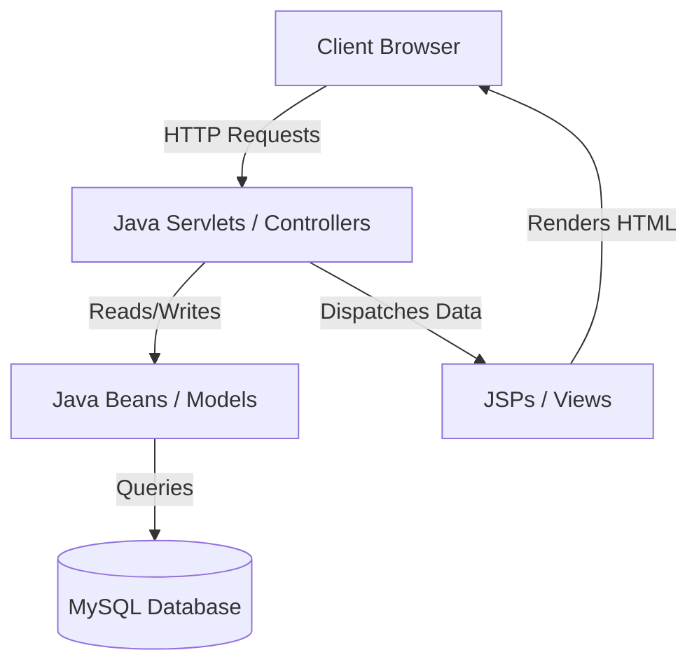

# Indian Banking Management System

<div align="center">
  

  <br />

  [](https://www.oracle.com/java/)
  [](https://www.mysql.com/)
  [](https://tomcat.apache.org/)
  [](https://opensource.org/licenses/MIT)
</div>

<br />

A robust, enterprise-grade banking application designed to simulate core Indian banking operations. This system provides a comprehensive platform for both banking administrators and customers, prioritizing secure transactions, seamless account management, and database consistency.

---

## 📖 Table of Contents
* [🌟 Key Features](#-key-features)
* [🛠️ Tech Stack](#️-tech-stack)
* [⚙️ Architecture & Design Patterns](#️-architecture--design-patterns)
* [🔐 Security & Transactional Integrity](#-security--transactional-integrity)
* [🚀 Getting Started](#-getting-started)
* [🤝 Collaboration & Contribution](#-collaboration--contribution)

---

## 🌟 Key Features

### 👤 Customer Experience
* **Secure Authentication & Onboarding**: Simplified registration process with password encryption and secure session-based login.
* **Interactive Account Dashboard**: Real-time overview of current balances, profile settings, and account details.
* **ACID-Compliant Transfers**: Bulletproof money transfer system ensuring funds are consistently updated across accounts without data anomalies.
* **Detailed Transaction History**: A comprehensive, chronologically sorted ledger tracking all incoming and outgoing funds.

### 👑 Administrator Control Panel
* **Account Verification Funnel**: A robust vetting process for reviewing, approving, or rejecting new customer registration requests.
* **Role-Based Access Control (RBAC)**: Strict segregation of administrative endpoints and operational logic from general customer utilities.
* **Account Lifecycle Management**: Full control to monitor, freeze, or update global account details.

---

## 🛠️ Tech Stack

| Layer | Technology | Purpose |
| :--- | :--- | :--- |
| **Language** | Java 17+ | Core business logic and servlet compilation |
| **Backend Framework** | Java Servlets & JSP | Request routing and server-side page rendering |
| **Database** | MySQL 8.0 | Structured relational data storage |
| **Server** | Apache Tomcat 9.0+ | Servlet container and application server hosting |
| **Frontend** | HTML5, CSS3, JavaScript | Modern, responsive client-side interface |

---

## ⚙️ Architecture & Design Patterns

This project adheres strictly to the **MVC (Model-View-Controller)** architectural pattern to maintain separation of concerns:



* **Controllers** (e.g., `TransferServlet`, `LoginServlet`) orchestrate the request flow, validate input, and dispatch execution.
* **Models** manage database connectivity and encapsulate the core business objects.
* **Views** use JSP (JavaServer Pages) to construct dynamic web templates using JSTL/Expression Language.

---

## 🔐 Security & Transactional Integrity

A cornerstone of this system is the **ACID-compliant transfer funnel** found in `TransferServlet.java`. To guarantee that no money is lost, created, or duplicated:

1. **Transaction Isolation**: Auto-commit is disabled (`connection.setAutoCommit(false)`) at the beginning of the transaction.
2. **Strict Validation**: Checks if the sender has sufficient balance and if the recipient account exists.
3. **Atomic Updates**: Debit and credit operations run within the same SQL transaction block.
4. **Resilient Rollbacks**: Any database exception or failure triggers an immediate `connection.rollback()` to prevent partial updates.
5. **Session Guarding**: Every state-altering action checks for active session tokens to block unauthorized operations.

---

## 🚀 Getting Started

### 📋 Prerequisites
* **JDK 17 or higher** installed.
* **Apache Tomcat 9.0+** installed.
* **MySQL Server** running locally.
* An IDE (e.g., **Eclipse Enterprise Edition** or IntelliJ IDEA).

### 🗄️ Database Initialization
Import the schema into your MySQL instance:
```bash
mysql -u root -p < sql/schema.sql
```

### 💻 Local Run
1. Clone the repository:
   ```bash
   git clone https://github.com/rishipatni7/indian-banking-system.git
   ```
2. Import the project into your Java EE IDE as a Dynamic Web Project.
3. Configure the database credentials in [DBConnectionManager.java](file:///c:/Users/Rishi/eclipse-workspace/BankManage/src/main/java/com/bankmanage/util/DBConnectionManager.java).
4. Run the project on your Apache Tomcat server.
5. Access the application at `http://localhost:8080/BankManage`.

---

## 🤝 Collaboration & Contribution
We welcome contributions to make the Indian Banking Management System even more feature-rich and secure! 

* **Collaborator**: [Atharv3105](https://github.com/Atharv3105)
* To contribute, please fork the repository, make your changes on a feature branch, and submit a Pull Request.

---
*Developed with ❤️ as a showcase of secure, enterprise Java Web Application development.*
